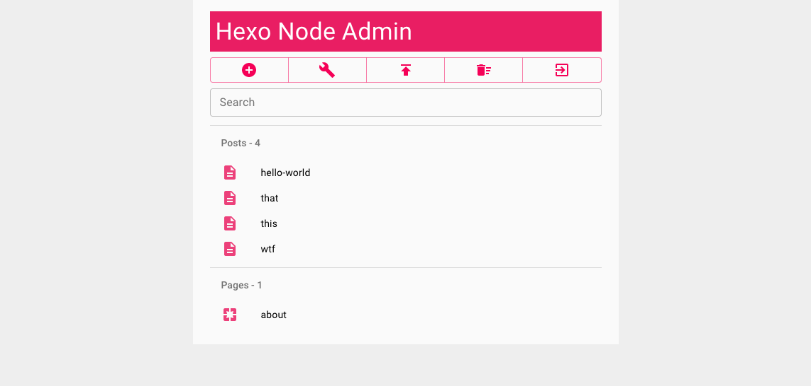
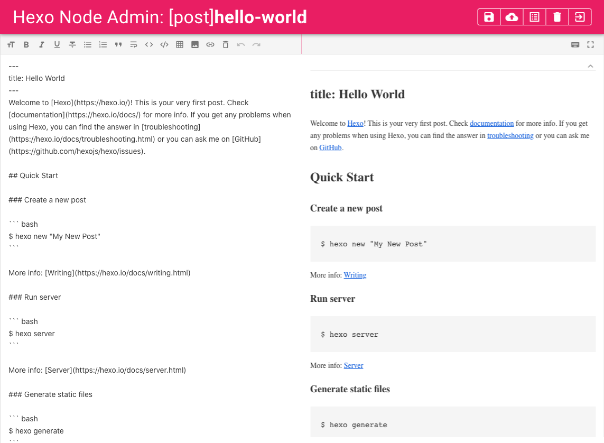

# Hexo Node Admin

A [Hexo](https://hexo.io/) management tool with **fully responsive** UI designed to make it easier for you to compose and manage your posts and pages. If you like it, do not forget to Star. Many thanks.

## Screenshots




## Migrate from v0 to v1

Follow the Quick Start section and you should be good.

## Hexo Version

Works with `4.x`, `3.x`, not sure if it works with `2.x` or `1.x`, you can give it a try :D.

## Quick Start

1. Clone this repository or download from [Release](https://github.com/quincyyhuang/hexo-node-admin/releases)

```
git clone https://github.com/quincyyhuang/hexo-node-admin
cd hexo-node-admin
```

2. Install dependencies.

```
npm install
```

3. Set up `config.json`.

```
{
    "root": "/",
    "host": "localhost",
    "port": 4001,
    "hexo_dir": "",     // Change this to the path to your hexo root folder, can be relative path, relative to hexo-node-admin folder
    "admin": {
        "plain": true,
        "username": "test",     // Change username
        "password": "test"      // Change password
    },
    "deploy": {
        "type": "default",
        "script": ""
    },
    "lang": "en-US",
    "jwt_secret": ""
}
```

4. Start Hexo Node Admin and go to `http://localhost:4001`.

```
npm start
```

## Secure the Admin

You can avoid using plain text password by setting `admin.plain` to `false`. Use [any](https://bcrypt-generator.com/) bcrypt generator to hash your password and paste the result in `admin.password`. You should also use HTTPS to secure the traffic if the admin is going to be exposed to the Internet.

## Features

- Support loading the admin on subdirectory. For example, '/admin' of your blog URL.
- Support [Post Asset Folder](https://hexo.io/docs/asset-folders#Post-Asset-Folder) feature. You can upload and delete post assets.

## Localization

Currently supported languages:
- English (United States): `en-US`
- 简体中文 Simplified Chinese (PRC): `zh-CN`
- 正體中文 Traditional Chinese (Taiwan): `zh-TW`

## Advanced Configuration

Change `config.json` to match your needs.

|     config     |                                                                      value                                                                     |
|:--------------:|:----------------------------------------------------------------------------------------------------------------------------------------------:|
|      `root`      |                          The root path for mounting the admin. Default to `'/'`. Can be set to subdirectory as `'/admin'`.                         |
|      `host`      |                              The address to listen on. Default to `'localhost'`. To listen on all, set to `'0.0.0.0'`.                             |
|      `port`      |                                                     The port to listen on. Default to `4001`.                                                    |
|    `hexo_dir`    |              Path to your hexo blog root folder. If using relative path, the path will be relative to the 'hexo-node-admin' folder.             |
|   `admin.plain`  |                               If using plain text password. Default to `true`. Set to `false` to use hashed password.                              |
| `admin.username` |                                                               Username for login.                                                              |
| `admin.password` |      Password for login. If `admin.plain == true`, this is plain text password.If `admin.plain == false`, this needs to be a bcrypt-ed hash.      |
|   `deploy.type`  | Type for deployment. Default to `'default'`, this runs `hexo deploy`. Set to `'command'` to run a single command. Set to `'script'` to run a script. |
|  `deploy.script` |        If `deploy.type == 'command'`, this is the one line command to execute. If `deploy.type == 'script'`, this is the path to the script.       |
|      `lang`      |                           Language to use. Default to `'en-US'`. All available options please see localization section.                          |
|   `jwt_secret`   |   JSON web token secret. Default to empty, this will make the admin generate a random secret on every start. You can set it to any string.  |

# Credits

This project is using [React](https://reactjs.org/), [React Redux](https://react-redux.js.org/), [Material UI](https://material-ui.com/) and [JWT](https://jwt.io/). Special credit to [react-markdown-editor-lite](https://github.com/HarryChen0506/react-markdown-editor-lite). All third-party software follows their own licenses.